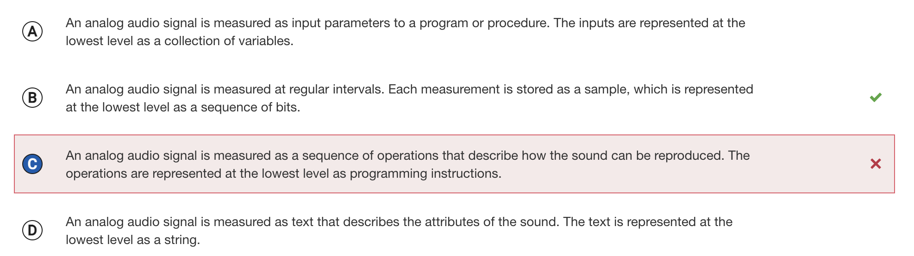
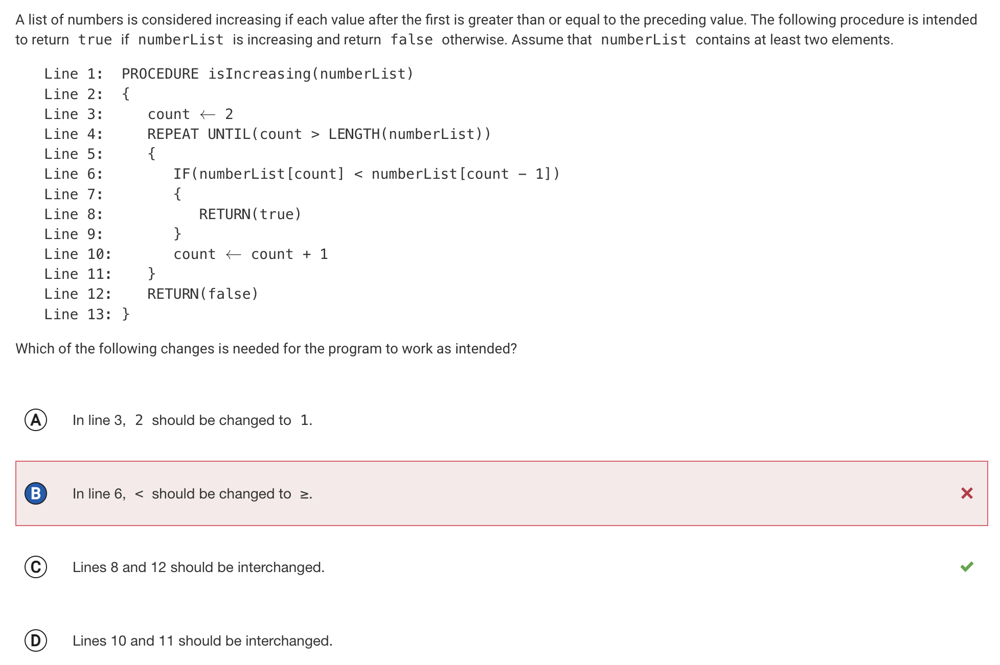
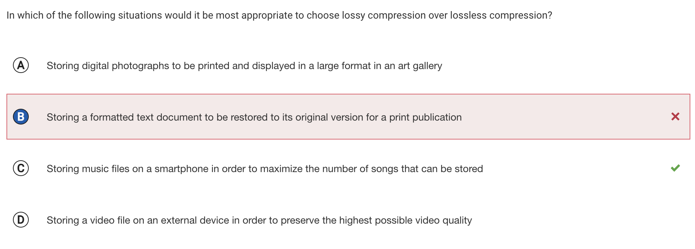
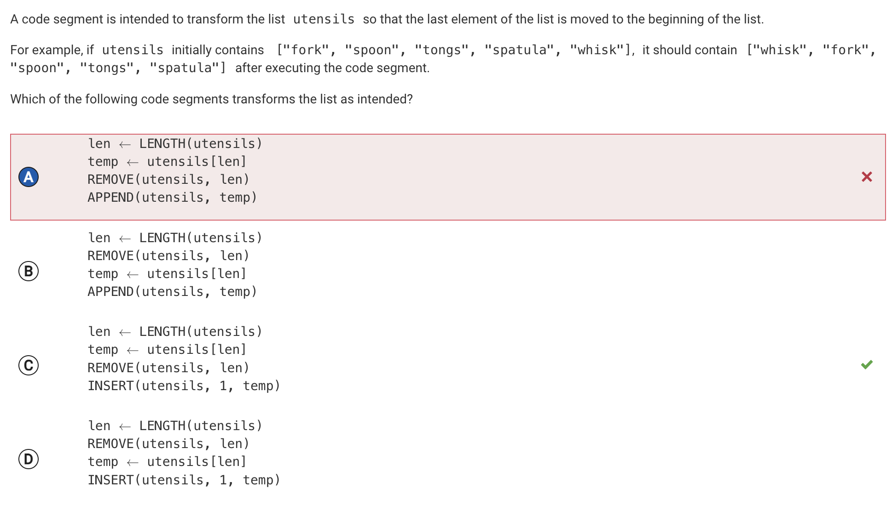
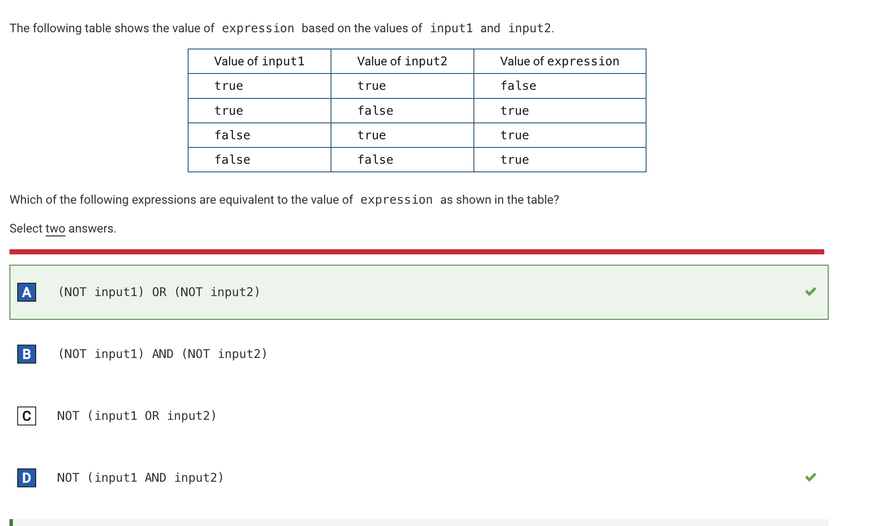
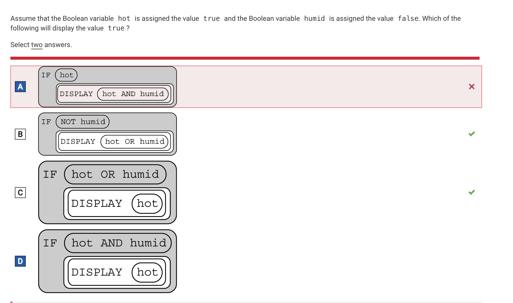
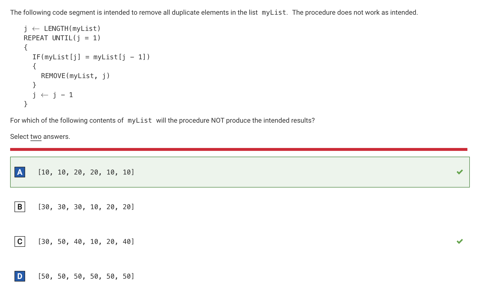

SCORE : 63/70
Questions Wrong: #9, #14, #24, #55, #63, #65, #68

        - 9  
                Question Answer:

                Explanation: While some programming languages can be used to manipulate audio data, this is not how audio data are represented digitally. At the lowest level, all digital data are represented as sequences of bits.

        - 14
                Question Answer:
                

                Explanation: By making this change, the procedure will immediately return true any time it encounters a value that is greater than or equal to the preceding value. It will not check any subsequent values in the list.

        - 24    
                Question Answer:

                
                Explanation: In situations where the ability to reconstruct an original is maximally important, lossless compression algorithms are typically chosen.

        - 55    
                Question Answer:

                
                Explanation: This code segment assigns the value of the last element of the list to the variable temp, then removes the last element of the list, then appends temp to the end of the list. The resulting list is the same as the original list.

        - 63    
                Question Answer:

                
                Explanation: When input1 and input2 are both true, the expressions (NOT input1) and (NOT input2) are both false, so (NOT input1) OR (NOT input2) will evaluate to false. In all other cases, either (NOT input1) or (NOT input2) (or both) will evaluate to true, so (NOT input1) OR (NOT input2) will evaluate to true.

        - 65    
                Question Answer:

                
                Explanation: Since hot is true, the body of the IF statement is executed. Since hot AND humid evaluates to false, false is displayed.

        - 68   
                Question Answer:

                
                Explanation: The code segment will iterate over myList from right to left, removing each element that is equal in value to the element immediately preceding it. For this list, the code segment will remove the sixth element (10), the fourth element (20), and the second element (10). This results in the list [10, 20, 10], which still contains duplicates.
